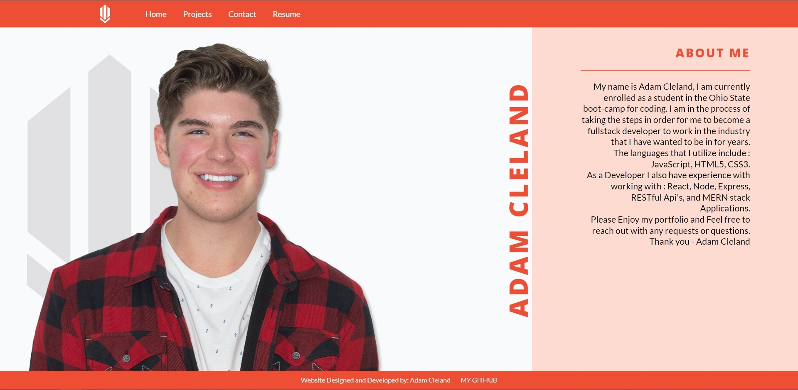
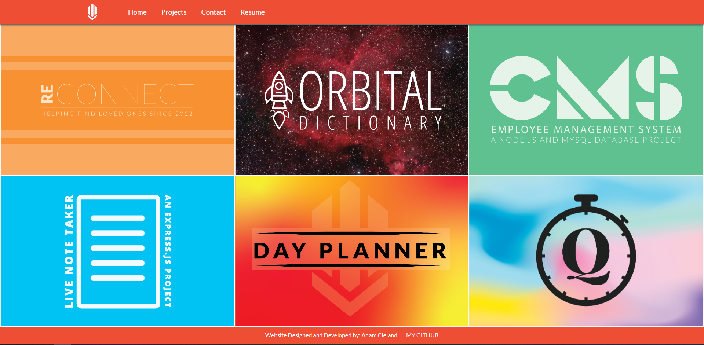

# adam-cleland-personal-portfolio-react-website

### Description

This is my personal portfolio website, I decided to take more original website that was primarily html and css and turn it into a full react application to better showcase my abilities.

I hope you enjoy!

## Table of contents

---

- **Live Link**
- **Screenshots**
- **Contributions**
- **Questions**
- **License**

## Live Link

---

The site is launched via github pages,
[Click Me For Live Site](https://aclelandx.github.io/adam-cleland-personal-portdolio-react-website)

## ScreenShots

---

## Contributions / Questions

---

This is my personal portfolio, I would prefer to work on it on my own, if you have a suggestion on an edit or a fix; Feel free to message me on linkedIn or Reach out to me on Github / Email

Github: [aclelandx](https://github.com/aclelandx)

Email: <aClelandx@gmail.com>
